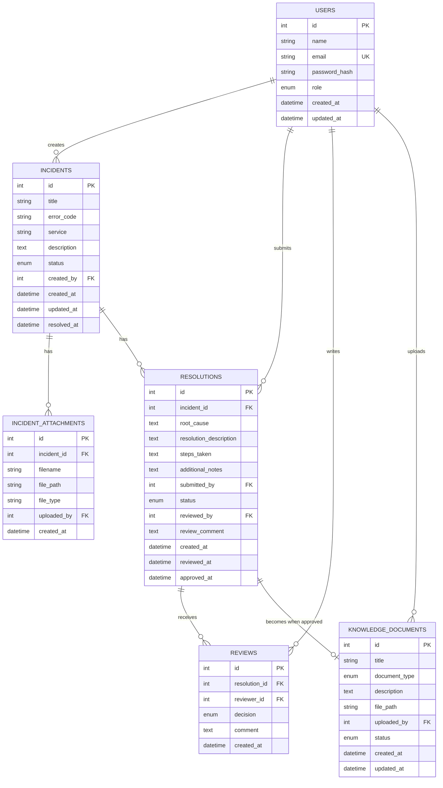

# Enterprise IT Incident Knowledge RAG Assistant

Academic project (Fundamentals of AI). Core approach: **RAG + semantic embeddings + vector retrieval + LLM generation**.
No custom ML/DL training. Not a ServiceNow/Jira clone. Not a generic PDF chatbot.

> ServiceNow / Jira Service Management already offer enterprise incident management and AI assistance.
> This is a focused prototype of RAG, semantic retrieval, source-grounded generation,
> role-based knowledge approval and continuous knowledge updating.

---

## >>> RESUME HERE (status tracker)

**Current phase: PHASE 1 built, waiting for user's test output.**

| Phase | Scope | Status |
|---|---|---|
| 1 | Backend setup, PostgreSQL, psycopg 3, env config, health endpoint | BUILT (verify locally) |
| 2 | Auth: registration, JWT, password hashing, login, RBAC | BUILT |
| 3 | Incidents: CRUD, status, attachments | TODO |
| 4 | Knowledge ingestion: upload, extraction, chunking, embeddings, FAISS | TODO |
| 5 | RAG: query embedding, top-K, context, LLM, sources, no-match | TODO |
| 6 | Resolution: mark resolved, form, evidence, submit | TODO |
| 7 | Review: IT Lead dashboard, approve/reject/request changes | TODO |
| 8 | Feedback loop: approved resolution -> chunk -> embed -> FAISS | TODO |
| 9 | React UI integration | TODO |
| 10 | Testing, evaluation dataset, polish | TODO |

**First milestone (do before the rest):** "504 Gateway Timeout after deployment" -> embedding -> FAISS -> relevant doc -> LLM -> answer + source. This is delivered in Phases 4-5 using the synthetic data.

### How to continue in a new chat
Paste the original project prompt (or this README) plus this message:

> Continue the Enterprise IT Incident Knowledge RAG Assistant from README.md.
> Current phase: PHASE X. Here is my output/error: ...
> Do not change the architecture. Give exact files, full code, commands, env vars, run and test steps.

Update the table above after each phase passes.

---

## Architecture (confirmed, unchanged)

```
React (Vite + Tailwind)
   | REST
FastAPI  -> Auth | Incidents | RAG | Resolutions | Reviews | RBAC | Uploads | Knowledge
   |                          |
PostgreSQL                  FAISS  -> RAG engine -> LLM
```

Closed-loop lifecycle:
Incident -> RAG retrieval -> Investigation -> Resolution -> Submission -> Role-based review -> Approval -> Embed + index -> Future RAG.

Rules: only APPROVED knowledge is retrievable. If nothing is relevant enough, answer
"No sufficiently relevant approved knowledge was found for this incident." (never hallucinate).
Answers must separate *historical evidence* from *current confirmed cause*.

Stack: React, Vite, Tailwind | Python, FastAPI | PostgreSQL, psycopg 3 (direct SQL) | JWT + bcrypt |
FAISS | pretrained sentence-embedding model | API/local pretrained LLM | local file storage.
Design keeps migration paths open: S3 (file storage), pgvector (vector store).

## Roles
- **SUPPORT_ENGINEER**: create/update own incidents, RAG search, resolve, submit resolution + evidence. Cannot approve own work, edit approved knowledge, manage users.
- **IT_LEAD**: everything for review: pending resolutions, evidence, approve/reject/request changes, edit/verify, incident history, manage trusted knowledge.
- **ADMIN**: users, roles, knowledge sources, upload/delete/update documents, settings, system-wide incidents.

## ER design



Enums: role (SUPPORT_ENGINEER, IT_LEAD, ADMIN) | incident status (OPEN, IN_PROGRESS, RESOLVED, CLOSED) |
resolution status (PENDING_REVIEW, APPROVED, REJECTED, CHANGES_REQUESTED) |
document type (RUNBOOK, POSTMORTEM, INCIDENT_REPORT, TROUBLESHOOTING_GUIDE, TECHNICAL_DOCUMENTATION, APPROVED_RESOLUTION) |
knowledge status (APPROVED, PENDING_REVIEW, REJECTED, OUTDATED).

Implementation note (decision log): roles are an enum column, not a separate table.
Planned addition at Phase 8: `knowledge_documents.resolution_id` (nullable FK) to link approved resolutions to their knowledge entry; will be explained when introduced.

FAISS chunk metadata (stored alongside vectors): document_id, document_type, title, source, incident_id, chunk_id, created_at, status.

## Folder structure

```
rag-project/
  README.md
  backend/
    requirements.txt  .env.example
    app/
      main.py
      core/        config.py  security.py  dependencies.py
      db/          database.py  schema.sql
      schemas/
      api/         health.py auth.py users.py incidents.py rag.py resolutions.py reviews.py knowledge.py
      services/    auth_ incident_ rag_ embedding_ document_ resolution_ review_ knowledge_ service.py
      rag/         embeddings.py retriever.py vector_store.py generator.py chunker.py
      utils/
    uploads/  vector_store/
  frontend/        (Phase 9)  src/{components,pages,layouts,services,hooks,context,utils}
```
Files present today are those needed for Phase 1; the rest are added phase by phase.

## Frontend routes (Phase 9)
Public: /login and /register. Authenticated routes include /dashboard, /incidents, /assistant, and /resolutions. IT_LEAD and ADMIN can open /reviews; ADMIN can open /knowledge.

## Authentication API
The existing `public.users` table is used without an authentication migration. No users are created automatically. Public registration creates SUPPORT_ENGINEER accounts only; an existing ADMIN can create IT_LEAD or ADMIN accounts with `POST /auth/users`.

- `POST /auth/register` creates an account and returns basic user information.
- `POST /auth/login` returns a bearer JWT.
- `GET /auth/me` returns the authenticated user's basic information.
- `GET /auth/users` and `POST /auth/users` let an ADMIN list and create users.
- `POST /rag/query` requires a valid bearer JWT.
- `GET /reviews/pending` is limited to IT_LEAD and ADMIN. Review actions reject a user's own resolution.
- Knowledge listing and PDF uploads are limited to ADMIN.

Set `JWT_SECRET_KEY`, `JWT_ALGORITHM=HS256`, and `ACCESS_TOKEN_EXPIRE_MINUTES=60` in `backend/.env`. Start the backend from the backend directory with `python -m uvicorn app.main:app --reload`; start the frontend from `frontend` with `npm run dev`.

To test in Swagger at `http://localhost:8000/docs`, register a real SUPPORT_ENGINEER account, log in, then use the returned token with **Authorize**. Call `GET /auth/me` and `POST /rag/query`. Verify role protection by calling `GET /reviews/pending` and `POST /knowledge/pdf` as SUPPORT_ENGINEER; both should return 403. To test IT_LEAD/ADMIN permissions, use accounts provisioned by an existing ADMIN; if there is no ADMIN account, provision the intended real account through the organization's trusted database administration process. Do not create test or fake privileged users.

---

## PHASE 1: run and test

Prerequisites: Python 3.10+, psycopg 3 dependencies, and the existing local PostgreSQL database `FOAI`.

```bash
# 1) backend environment
cd backend
python -m venv venv
# Windows:  venv\Scripts\activate
# Linux/Mac: source venv/bin/activate
pip install -r requirements.txt
# Create .env from .env.example only if .env does not already exist.

# 2) initialize tables in the existing FOAI database
psql -h localhost -p 5432 -U postgres -d FOAI -v ON_ERROR_STOP=1 -f app/db/schema.sql

# 3) run the API
uvicorn app.main:app --reload
```

Test:
- Open http://localhost:8000/api/health -> `{"status":"ok", ... "database":"up"}`
- Open http://localhost:8000/docs -> Swagger UI
- `"database":"down"` means PostgreSQL is not reachable. Check that the local PostgreSQL service is running and verify `DATABASE_URL` in `.env`.

**Existing database safety:** `schema.sql` checks for an incompatible existing `public.users` table and stops instead of changing or replacing it. The current FOAI database has an older `users` table, so reconcile its columns with the requested schema before running the command above. This project does not create, drop, or replace databases.

In pgAdmin, expand **FOAI → Schemas → public → Tables**, then refresh. After initialization succeeds, the six tables are `users`, `incidents`, `incident_attachments`, `resolutions`, `reviews`, and `knowledge_documents`.

## Environment variables
See `backend/.env.example`. Phase 1 uses APP_*, DEBUG, DATABASE_URL, CORS_ORIGINS. JWT_* is used from Phase 2, UPLOAD_*/VECTOR_* from Phases 3-4. LLM settings are added in Phase 5.

## Evaluation plan (Phase 10)
Retrieval relevance | source correctness | groundedness | answer usefulness | no-match behavior | RBAC correctness | knowledge update workflow. A small labelled query set will live in `backend/tests/eval/`.

## Test data plan (Phase 4)
Synthetic, de-identified: 504 Gateway Timeout after deployment, DB connection timeout, VPN authentication failure,
API 500, service unavailable after config update, Redis connection failure, auth service failure, deployment config mismatch.
Each gets incident + cause + resolution + troubleshooting guide (+ postmortem where appropriate).
